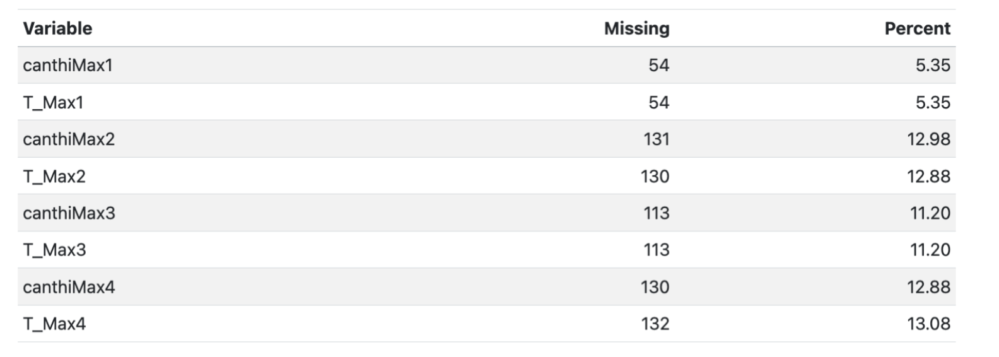
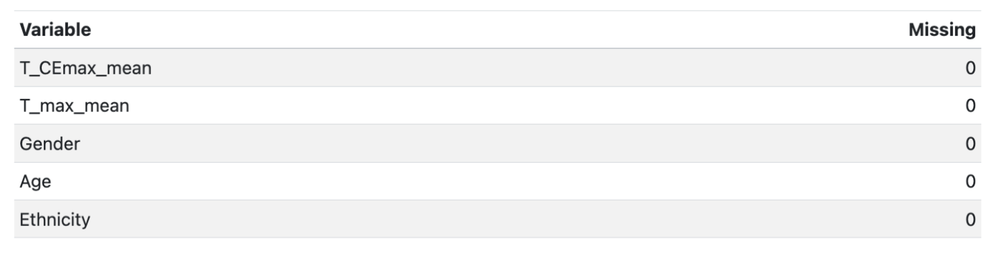
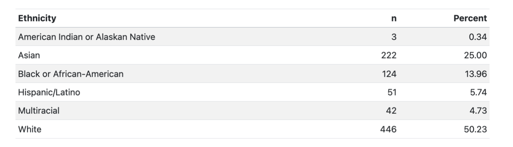
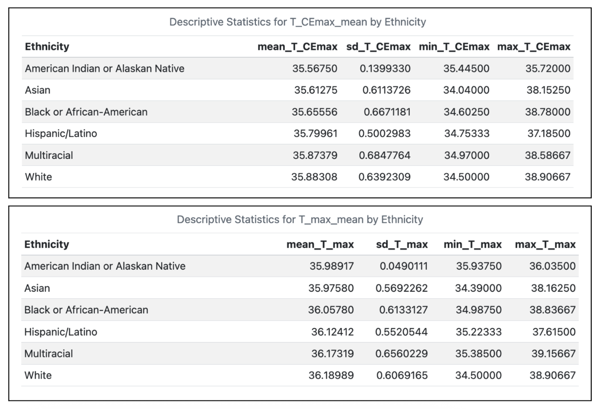
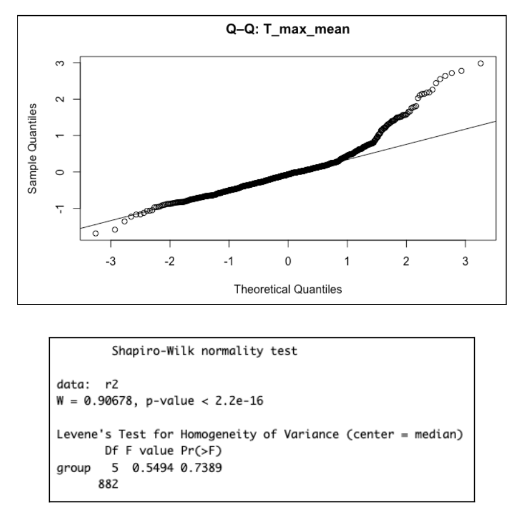
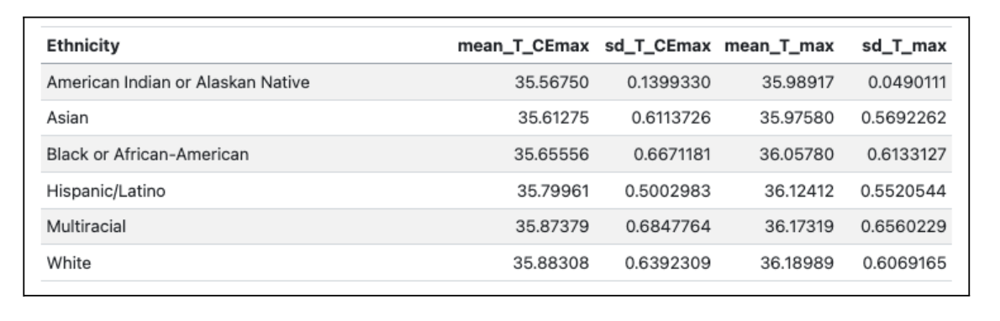
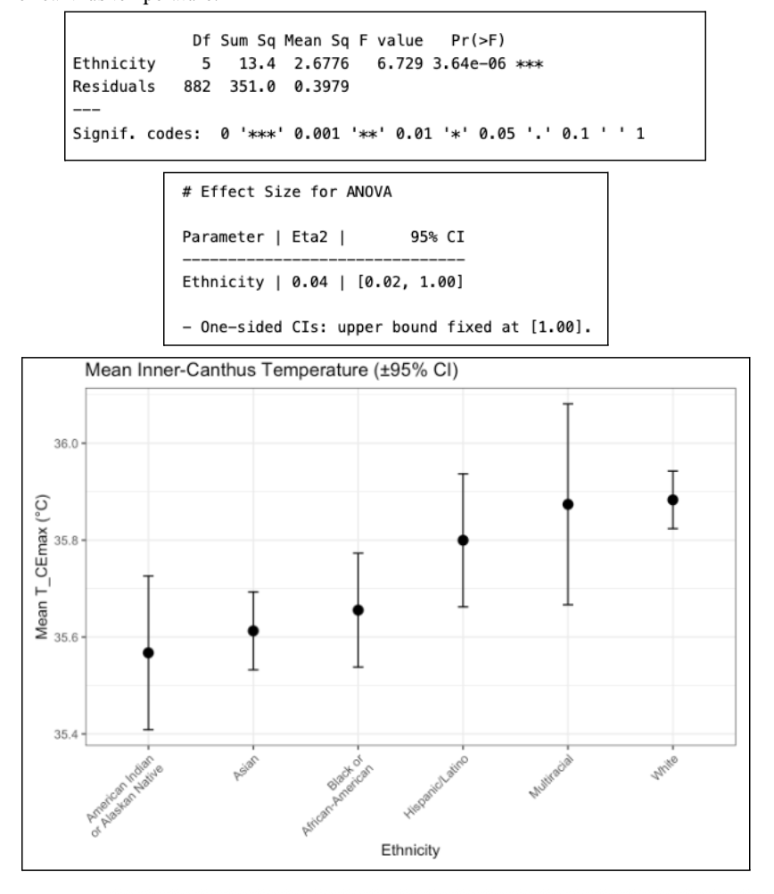
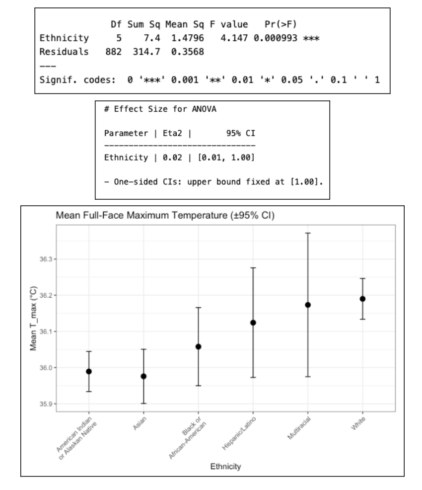

# The Significance of 37 °C: Temperature, Ethnicity, and the Limits of Normality
BIS 560 Final Project Analysis

## Data Cleaning (Excel) ##
The original raw dataset used for this project is available in the repository as [ICI_groups1and2.csv](ICI_groups1and2.csv)

Before importing the dataset into R, an initial round of cleaning was performed in Excel to simplify the raw file and retain only the variables required for analysis. The dataset was filtered to keep the essential demographic fields `SubjectID`, `Age`, and `Ethnicity` along with the four repeated measurement rounds for each validated facial temperature region (`canthiMax1–4` and `T_Max1–4`). Using these columns, the two averaged temperature variables for each participant was calculated : `T_CEmax_mean`, derived from the four canthus measurements, and `T_max_mean`, derived from the four full-face maximum measurements. Computing these averages reduces random noise across rounds and provides a more stable, reliable temperature estimate. The resulting cleaned dataset was saved as [data_pre_processed.csv](data_pre_processed.csv), which serves as the input for all subsequent preprocessing and analysis conducted in R.

## Data Pre-Processing ##
This stage imports the cleaned dataset, assesses completeness, and isolates the subset of variables used in the analysis. The dataset `data_pre_processed.csv` contains all temperature measurements recorded across four rounds, along with corresponding demographic fields. To quantify data quality, missing values are evaluated for each round and measurement type `canthiMax` and `T_Max` before mean values are computed. The resulting table expresses missingness both as raw counts and as percentages relative to the total sample size, providing a transparent account of where attrition or sensor loss may have occurred.

After verifying completeness, the dataset is restricted to the analytic subset: `T_CEmax_mean`, `T_max_mean`, `Age`, and `Ethnicity`. The focus on these columns aligns with validated variables and ensures that subsequent computations are limited to fields directly relevant to the analytic question. Age is filtered to retain participants between 18 and 30 years, mirroring the study’s dominant demographic composition and minimizing variability attributable to thermoregulatory differences outside this range. The resulting cleaned dataset is provided in this repository as [analytic_subset.csv](analytic_subset.csv), and the previewed output confirms that it contains only the intended records and variables.

## Data Pre-Analysis Summary Statistics ##
Following the construction of the analytic subset, a second completeness assessment confirms the absence of residual missingness in the primary analysis variables. This step ensures that the averaged thermal values `T_CEmax_mean` and `T_max_mean` are not compromised by incomplete data from earlier rounds. The summary table provides a compact audit trail of data integrity after aggregation.

To contextualize the sample composition, the distribution of ethnicity is then summarized as both counts and percentages. This table reflects the categorical encoding used in the source dataset—derived from administrative reporting rather than biological classification—and provides an overview of representation across groups. Because several categories are sparsely populated, these descriptive statistics are primarily interpretive rather than inferential, clarifying the dataset’s internal structure and highlighting the limitations of subgroup analysis.

## Descriptive Statistics ##
To characterize temperature variation across the analytic sample, descriptive statistics were computed for both infrared measures (`T_CEmax_mean` and `T_max_mean`) within each ethnicity category. Each table reports the mean, standard deviation, and observed range (minimum and maximum), providing a fuller view of within-group variability and confirming the absence of extreme outliers.

## Statistical Assumptions ##
Before conducting inferential tests, the analytic subset was evaluated to ensure that one-way ANOVA was appropriate for both temperature outcomes. Residual diagnostics were generated for each model, including:
- Q–Q plots, used to visually assess approximate residual normality
- Shapiro–Wilk tests, providing a formal test of normality
- Brown–Forsythe tests, evaluating homogeneity of variances across ethnicity groups

These diagnostics were computed separately for `T_CEmax_mean` and `T_max_mean`. In both cases, the Q–Q plots showed only minor tail deviations consistent with large sample sizes, and the Brown–Forsythe tests indicated no evidence of unequal variances. Although the Shapiro–Wilk test detected statistical non-normality—expected with >800 observations—the residual distributions were sufficiently regular for ANOVA to proceed.

`T_CEmax_mean`

`T_max_mean`

## Descriptive Statistics ##
To characterize temperature variation across the analytic sample, mean values and standard deviations were computed for both temperature measures (`T_CEmax_mean` and `T_max_mean`) within each ethnicity category. These descriptive statistics provide the first indication of between-group differences and contextualize the subsequent inferential analyses. While the absolute differences across groups are modest, the pattern reveals slightly higher mean temperatures among Hispanic/Latino, Multiracial, and White participants relative to Asian and American Indian/Alaskan Native participants.

## ANOVA Analysis ##

One-way ANOVA models were fit to evaluate whether mean inner-canthus temperature (T_CEmax_mean) and full-face maximum temperature (T_max_mean) differed across self-reported ethnicity categories.

For `T_CEmax_mean`, the ANOVA detected a statistically significant effect of ethnicity, with a small but nonzero effect size (η² = 0.04). The full model output and corresponding visualization—showing group means with 95% confidence intervals—are included below.

For `T_max_mean`, the analysis indicated a similarly significant but smaller effect (η² = 0.02). As with the first model, a visualization is generated to illustrate mean differences and uncertainty across groups.

These outputs provide the complete statistical basis for the ANOVA results described in the written analysis and reproduce the figures included in Appendix E of the final report.
